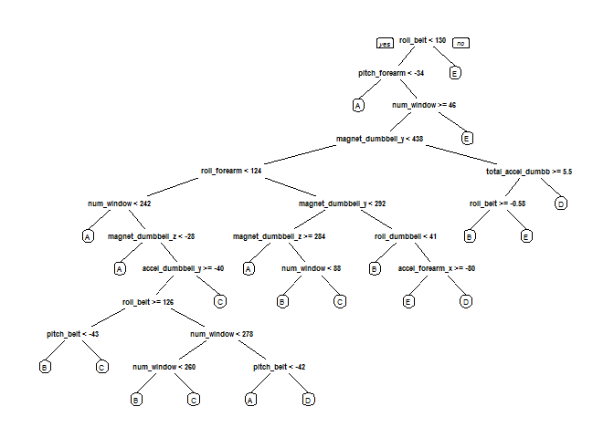

# Practical Machine Learning by Coursera - Project Assignment
Igor Hut  
01 jun 2016   

## Introduction  
Using devices such as Jawbone Up, Nike FuelBand, and Fitbit it is now possible to collect a large amount of data about personal activity relatively inexpensively. These type of devices are part of the quantified self movement – a group of enthusiasts who take measurements about themselves regularly to improve their health, to find patterns in their behavior, or because they are tech geeks. One thing that people regularly do is quantify how much of a particular activity they do, but they rarely quantify how well they do it.  

In this project, we will use data from accelerometers on the belt, forearm, arm, and dumbell of 6 participants to predict the manner in which they did the exercise. They were asked to perform barbell lifts correctly and incorrectly in 5 different ways. More information regarding the whole experiment is available from the website here: <http://groupware.les.inf.puc-rio.br/har>. 

## Initial preparation - Loading necessary packages and basic data preparation 

```r
library(caret)
```

```
## Loading required package: lattice
```

```
## Loading required package: ggplot2
```

```r
library(randomForest)
```

```
## Warning: package 'randomForest' was built under R version 3.2.5
```

```
## randomForest 4.6-12
```

```
## Type rfNews() to see new features/changes/bug fixes.
```

```
## 
## Attaching package: 'randomForest'
```

```
## The following object is masked from 'package:ggplot2':
## 
##     margin
```

```r
library(rpart)
library(rpart.plot)
```

```
## Warning: package 'rpart.plot' was built under R version 3.2.5
```
### Downloading the data

```r
trainDataUrl <-"https://d396qusza40orc.cloudfront.net/predmachlearn/pml-training.csv"
testDataUrl <- "https://d396qusza40orc.cloudfront.net/predmachlearn/pml-testing.csv"
trainData <- "./data/pml-training.csv"
testData  <- "./data/pml-testing.csv"
if (!file.exists("./data")) {
  dir.create("./data")
}
if (!file.exists(trainData)) {
  download.file(trainDatUrl, destfile=trainData)
}
if (!file.exists(testData)) {
  download.file(testDataUrl, destfile=testData)
}
```
### Reading in and checking the data
After downloading the data from the data source, we can read the two csv files into two data frames.  

```r
trainDataRaw <- read.csv("./data/pml-training.csv")
testDataRaw <- read.csv("./data/pml-testing.csv")
dim(trainDataRaw)
```

```
## [1] 19622   160
```

```r
dim(testDataRaw)
```

```
## [1]  20 160
```
As can be observed the training data set contains 19622 observations and 160 variables, while the testing data set contains 20 observations and 160 variables. The "classe" variable in the training set is the outcome to predict. 

### Spliting the data set

We are going to split the training data set into a pure training data set (70%) and a validation data set (30%).The former will be used to perform cross validation in forthcoming steps.  


```r
set.seed(33)
inTrain <- createDataPartition(y=trainDataRaw$classe, p=0.7, list=F)
trainSet <-trainDataRaw[inTrain, ]
testSet<- trainDataRaw[-inTrain, ]
```

### Cleaning the data

In this section we are going to reduce the number of features by removing variables with nearly zero variance, variables that are almost always NA, as well as variables that wouldn't play any meaningful role in the prediction task. 


```r
# Removing vars with nearly zero variance
nzv <- nearZeroVar(trainSet)
trainSet <- trainSet[, -nzv]
testSet <- testSet[, -nzv]

# Removing vars that are almost always NA
mostlyNA <- sapply(trainSet, function(x) mean(is.na(x))) > 0.95
trainSet <- trainSet[, mostlyNA==F]
testSet <- testSet[, mostlyNA==F]

# Removing variables that don't play any meaningful role in the prediction task (X, user_name, raw_timestamp_part_1, raw_timestamp_part_2, cvtd_timestamp). These are the first five variables in the given data set.

trainSet <- trainSet[, -(1:5)]
testSet <- testSet[, -(1:5)]

dim(trainSet)
```

```
## [1] 13737    54
```

```r
dim(testSet)
```

```
## [1] 5885   54
```
Now, the cleaned training data set contains 13737 observations and 54 variables, while the cross validation testing data set contains 5885 observations and 54 variables. The "classe" variable is still in the cleaned training set.


## Data modeling

For the begining we will choose the **Random Forest** ML algorithm to fit a predictive model for activity recognition, and check how it behaves. This is our first choice since **RF** automatically selects important variables and is quite robust to correlated covariates & outliers in general. We will use **5-fold cross validation** when applying the algorithm.  


```r
# Train function will be using 5-fold CV to select optimal tuning parameters
trainFit <- trainControl(method="cv", number=5, verboseIter=F)

# Fitting the model on trainSet
modelFit <- train(classe ~ ., data=trainSet, method="rf", trControl=trainFit)

# Print final model to check which tuning parameters it chose
modelFit$finalModel
```

```
## 
## Call:
##  randomForest(x = x, y = y, mtry = param$mtry) 
##                Type of random forest: classification
##                      Number of trees: 500
## No. of variables tried at each split: 27
## 
##         OOB estimate of  error rate: 0.28%
## Confusion matrix:
##      A    B    C    D    E  class.error
## A 3905    1    0    0    0 0.0002560164
## B    3 2650    4    1    0 0.0030097818
## C    0    9 2386    1    0 0.0041736227
## D    0    0   11 2240    1 0.0053285968
## E    0    2    0    6 2517 0.0031683168
```

It can be seen that it decided to use 500 trees and try 27 variables at each split.

Further, we will estimate the performance of the model on the validation data set. 


### Model evaluation 

We are using the fitted model to predict the label (“classe”) in `testSet`. Confusion matrix enables us to compare the predicted versus the actual labels.


```r
preds <- predict(modelFit, newdata=testSet)

# Show the confusion matrix to get estimates of the accuracy and out-of-sample error
confusionMatrix(testSet$classe, preds)
```

```
## Confusion Matrix and Statistics
## 
##           Reference
## Prediction    A    B    C    D    E
##          A 1673    0    0    0    1
##          B    2 1137    0    0    0
##          C    0    1 1025    0    0
##          D    0    0    9  955    0
##          E    0    0    0    0 1082
## 
## Overall Statistics
##                                           
##                Accuracy : 0.9978          
##                  95% CI : (0.9962, 0.9988)
##     No Information Rate : 0.2846          
##     P-Value [Acc > NIR] : < 2.2e-16       
##                                           
##                   Kappa : 0.9972          
##  Mcnemar's Test P-Value : NA              
## 
## Statistics by Class:
## 
##                      Class: A Class: B Class: C Class: D Class: E
## Sensitivity            0.9988   0.9991   0.9913   1.0000   0.9991
## Specificity            0.9998   0.9996   0.9998   0.9982   1.0000
## Pos Pred Value         0.9994   0.9982   0.9990   0.9907   1.0000
## Neg Pred Value         0.9995   0.9998   0.9981   1.0000   0.9998
## Prevalence             0.2846   0.1934   0.1757   0.1623   0.1840
## Detection Rate         0.2843   0.1932   0.1742   0.1623   0.1839
## Detection Prevalence   0.2845   0.1935   0.1743   0.1638   0.1839
## Balanced Accuracy      0.9993   0.9993   0.9955   0.9991   0.9995
```

So, the estimated accuracy of the model is 99.72% and the estimated out-of-sample error is 0.28%.
This is quite a promising result, thus we will use **RF** algorithm to perform prediction on the given test set of 20 cases.

### Decision tree visualization


```r
tree <- rpart(classe ~ ., data=trainSet, method="class")
prp(tree) # this "fast" plot is better for visualisation of a complex tree than i.e. fancyRpartPlot which would be crammed
```



## Predicting for test data set

### Retraining the model

Before predicting on the test set, we will train the model, again, but this time on the full training set (`trainDataRaw`), rather than use a model obtained by fitting the reduced training set (`trainSet`). This should lead to more accurate predictions. Therefore we will repeat the whole data preprocessing procedure with `trainDataRaw` and `testDataRaw`.


```r
# Removing vars with nearly zero variance
nzv <- nearZeroVar(trainDataRaw)
trainFinal <- trainDataRaw[, -nzv]
testFinal <- testDataRaw[, -nzv]

# Removing vars that are almost always NA
mostlyNA <- sapply(trainFinal, function(x) mean(is.na(x))) > 0.95
trainFinal <- trainFinal[, mostlyNA==F]
testFinal <- testFinal[, mostlyNA==F]

# Removing variables that don't play any meaningful role in the prediction task (X, user_name, raw_timestamp_part_1, raw_timestamp_part_2, cvtd_timestamp). These are the first five variables in the given data set.

trainFinal <- trainFinal[, -(1:5)]
testFinal <- testFinal[, -(1:5)]

# Re-train the model with the full training set

trainFit <- trainControl(method="cv", number=5, verboseIter=F)
modelFinal <- train(classe ~ ., data=trainFinal, method="rf", trControl=trainFit)
```

### Aplying the final model for prediction on the test data set


```r
preds <- predict(modelFinal, newdata=testFinal)
preds
```

```
##  [1] B A B A A E D B A A B C B A E E A B B B
## Levels: A B C D E
```


